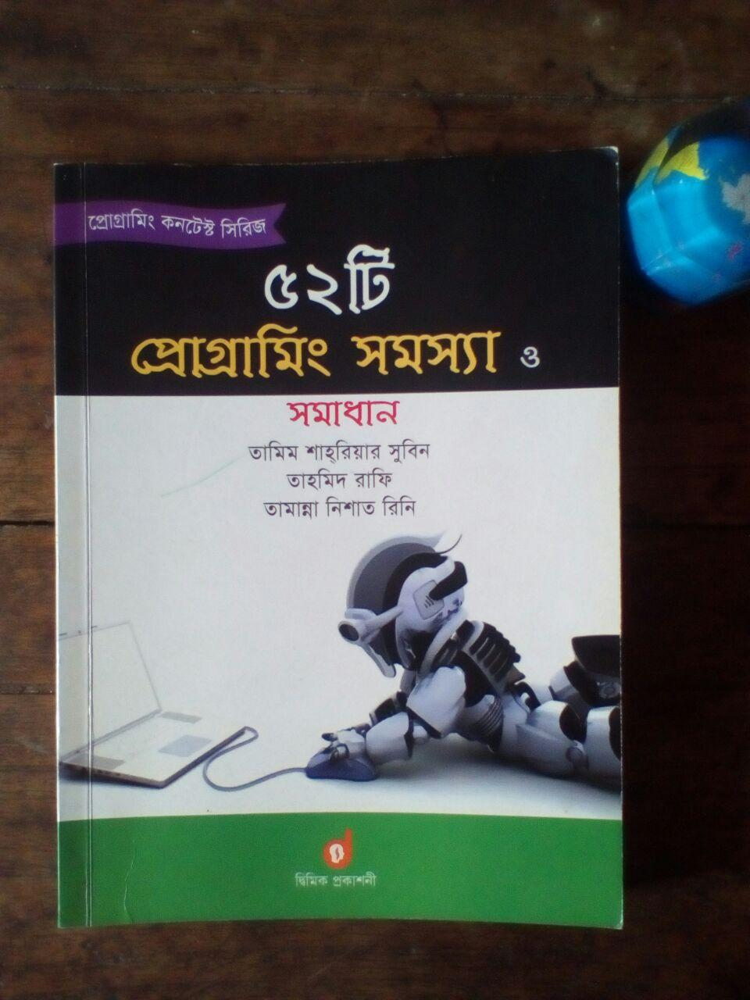
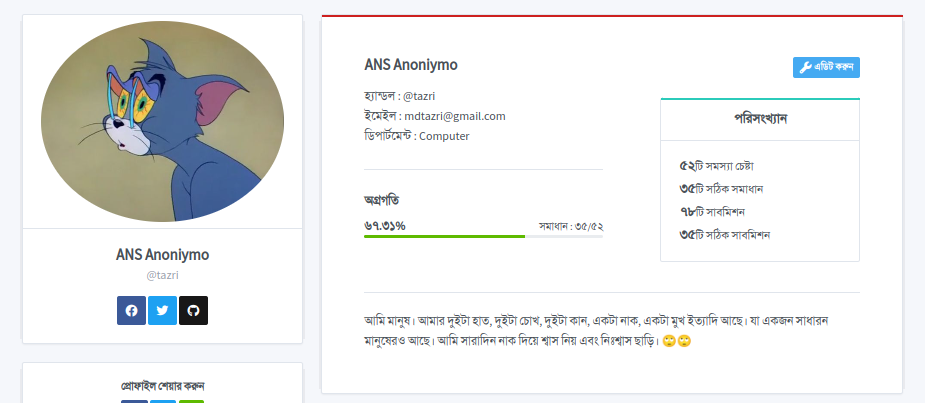
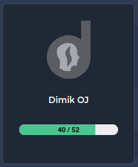

 

# 52 Programming Problem

This repository create for solve 52 programming problen in c. The book name "৫২টি প্রোগ্রামিং সমস্যা". This book have 52 various type of programming problem.I solve it in c programming language. Most of the case I can not see the solution.

**_The Book :_**

## Hardest Problem for me :

1. Problem 12: ফ্যাক্টরিয়াল ১০০
1. Problem 13: টমি মিয়ার প্রোবাবিলিটি
1. Problem 43: হিসাবকিতাব
1. Problem 44: প্যাসকেলের ত্রিভুজ ১
1. Problem 49: মৌলিক কি না

## Fun Problem for me :

1. Problem 27: আর্মস্ট্রং সংখ্যা
1. Problem 38: হীরক রাজ্য
1. Problem 44: প্যাসকেলের ত্রিভুজ ১
1. Problem 45: প্যাসকেলের ত্রিভুজ ২

## Last Modified (14 dec 2022)
I submit all the solution in [dimik oj](https://dimikoj.com/). But they can not accept my all solution. They reject 17 solution. I think this problem with dimik judge. Because they accept my one solution which is not correct perpective to problem output. Here my last status in dimik oj : 

## Here Light OJ status of Those Problem

## Last Word

I solve all the problem.I enjoy it so much and also learn something more new thing about c. One more thing. I learn new way to solve problem. Like find prime number use sieve of eratothenes algorithom new way.